# Gameplay Tutorial

This is a complete progression guide for Croparia IF based on Minecraft 1.20.1 with Croparia 0.2.4. If you're playing on
version 1.18.2, some features might be missing (mentioned later).

Since the mod introduces new recipe types and multi-block structures, it's strongly recommended to install REI or EMI.

## Progress

This guide will combine progress advancements and game progression for teaching purposes.

### 1. (Mainline) Ore Magic Seeds

First, you need to find and mine Elemental Ore in caves. You need at least an iron pickaxe to mine it.

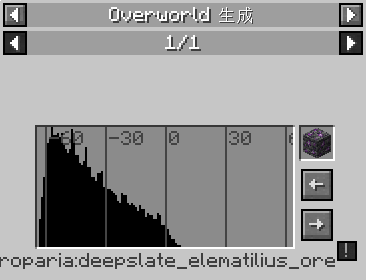
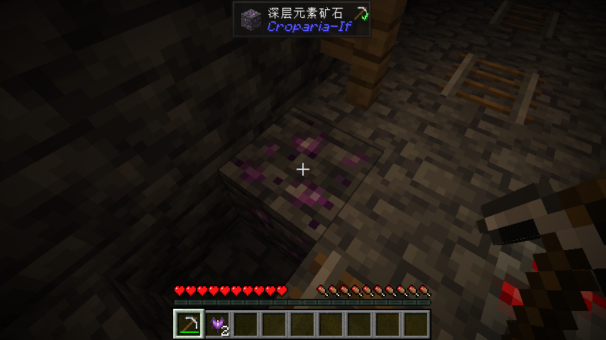

Mining it will drop Elemental Shards, and picking them up will unlock the root advancement Ore Magic Seeds.

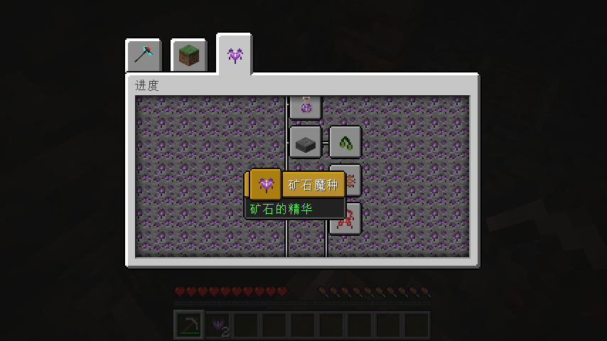

This ore is very rare! However, it can be mass-produced later, so it's recommended to mine it whenever you find it.

### 2. (Mainline) Bottle it up!

Combine the Elemental Shards you just obtained with a glass bottle to create a **Elemental Potion**. This will unlock
the advancement *Bottle it up!*

Be sure to save at least 8 to 16 *Elematilius* for mass production of crops later.

### 3. (Mainline) Apply the elemental magic

Crafting **Infusor** with stone bricks will unlock the advancement. One **Infusor** is enough.

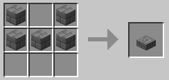

### 4. (Mainline) Let the magic grow

This advancement requires you to craft a **Croparia T1**, the most basic magic seed used to craft various material crop
seeds.

There are two ways to craft it. You can use the less efficient crafting table recipe:

Since Elematilius is quite rare in the early game, it's recommended to use the Infusor method:

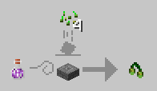

Place the Infusor on the ground, right-click **4 wheat seeds** onto it (you can place multiple stacks if you need many
Croparia T1), and finally, right-click the Infusor with a Potion of Elematilius to obtain the seeds. The order between
infusion & putting seeds is not strict.

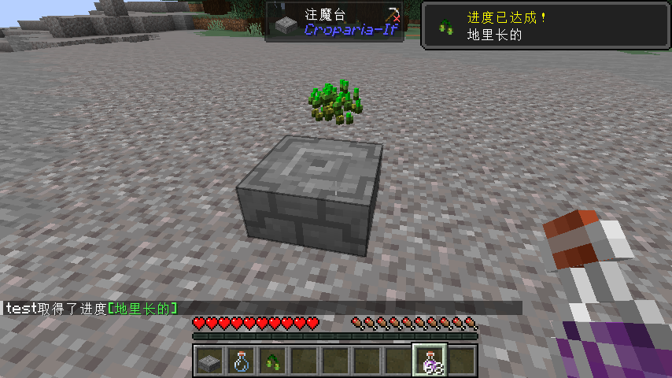

Once you have a Croparia T1, you can start creating various material crop seeds!

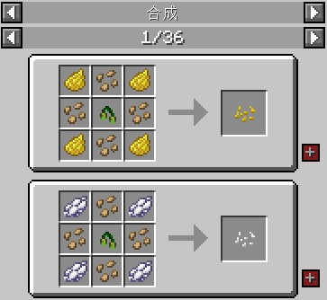

If you have installed mods like Modern Industrialization or Thermal Series, you can also automate the process using
their machines. Check REI or EMI for details.

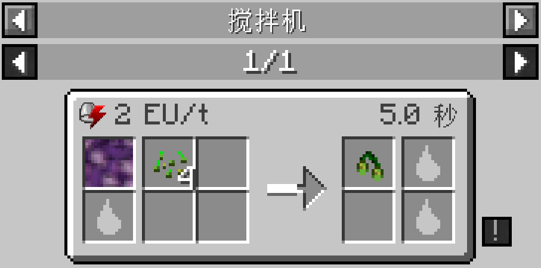

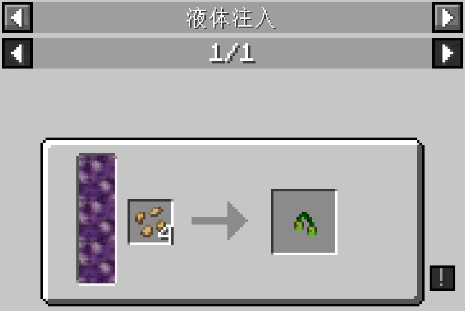

### 5. (Side Quest) Zen Gardening

If you want to automate crop harvesting, try using the **Greenhouse**!

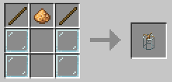

Place the Greenhouse near farmland or crops to automatically harvest them.

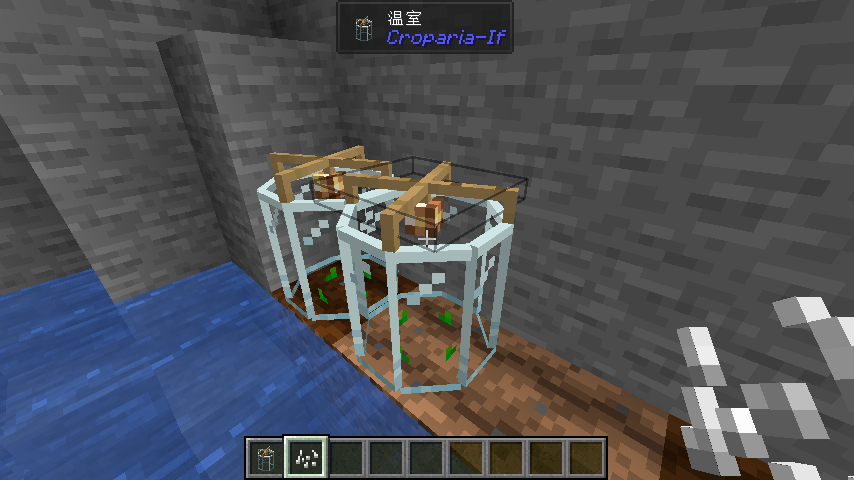

*Tips: You can use bone meal on crops with the Greenhouse for a more efficient automated crop line.*

### 6. (Mainline) Where the Elements Extracts

To craft seeds for more materials, you need higher-tier crop seeds. Crafting these requires materials from the **Tier 1
Elemental Ritual**.

First, craft a **Ritual Stand** to unlock this advancement.

Next, use REI or EMI to view the Tier 1 Ritual structure. Press the R key (default) while looking at the Ritual Stand to
see its structure.

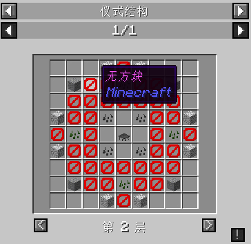

The page displays each cross-section of the multi-block structure. Click the buttons at the bottom to switch layers.
Empty spaces mean any block can be placed; red prohibition marks mean no blocks should be placed; input blocks (question
marks) are where items will be placed later and can be ignored for now.

Some blocks in the structure have attribute requirements! For example, the coal crop requires age=7 (i.e., a fully grown
crop).

You can check block attributes in the F3 debug info by looking at the block.

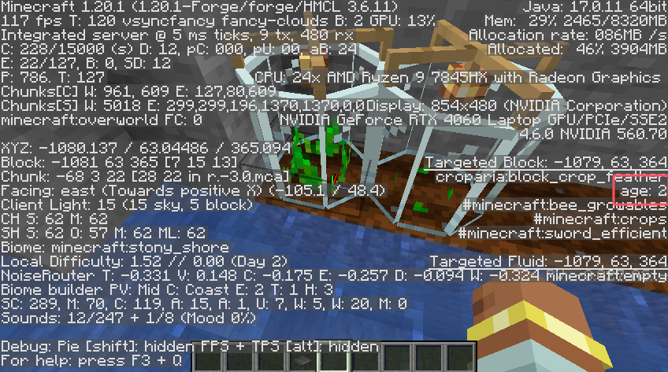

When the Ritual Stand is built correctly, it should look like this. If you drop an item on the altar and see the
message "The elematilius rejects your offering," the structure is successful. Otherwise, it will show "The elematilius
does not respond to the ritual."

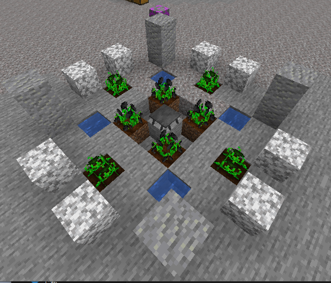

### 7. (Mainline) Heart of the Land

With the Tier 1 Elemental Ritual set up, you can start summoning other elemental materials. This advancement requires
crafting Elemental Earth.

First, check the recipe for **Elemental Earth**:

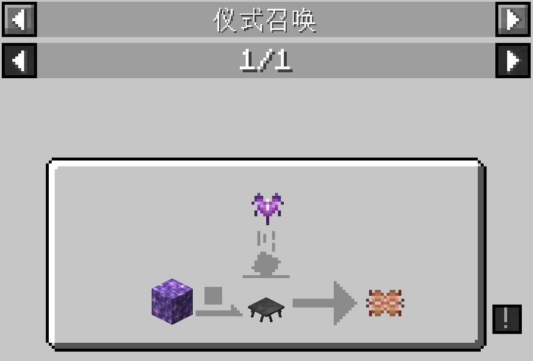

The left side of the recipe shows the input blocks, while the top shows the items that need to be dropped on the Ritual
Stand.

You can find input block positions on the earlier ritual structure page:

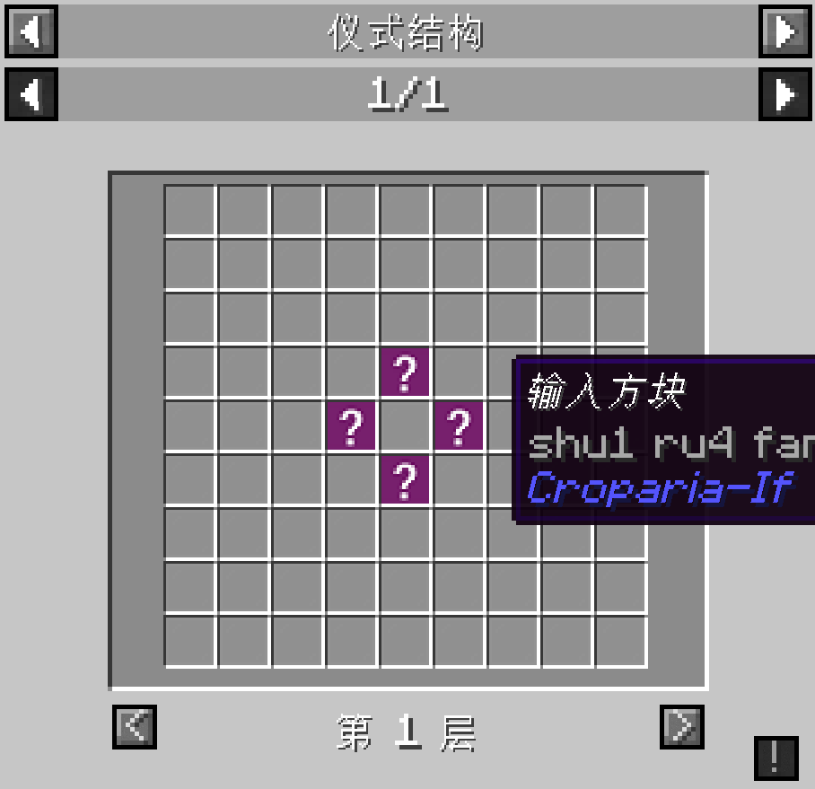

It should look like this when placed:

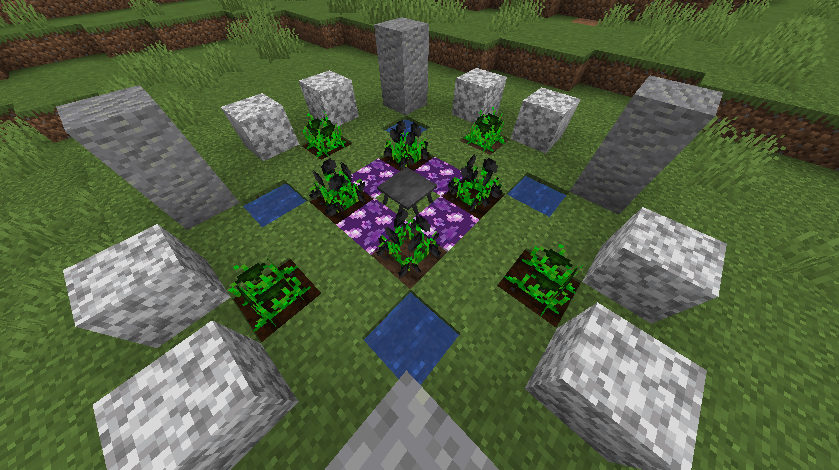

Drop the required item onto the Ritual Stand or right-click the altar to trigger the crafting process.

### 8. (Mainline) Upgrading Croparia, Spark is Tiny..., But Starts a Conflagration, Gaze into the Abyss..., and It Gazes at You

Similar to *4. Let the Magic Grow*, but with different elemental types and items. The process is not repeated here.

With **Croparia T2**, you can create Elematilius Seeds to grow Elematilius, and Bone Seeds. Combined with the
Greenhouse, you can get nearly infinite minerals!

With **Croparia T3**, you unlock all supported modded mineral seeds.

### 9. (Mainline) Atlantis, Whisper of the Wind

Similar to *7. Heart of the Land*, but with different input blocks and items. The process is not repeated here.

If you're playing MC 1.18.2 or earlier, you’ve reached the end of the mod's content as Deep Dark features are
unavailable. If you have suggestions for future content, feel free to submit them to the author on GitHub.

### 10. (Extension) Danger, Even More Danger, Can't Eat It All, You Win!, King's Curse, Endless Harvest

Apart from Tier 1 Elemental Rituals, this mod also has more advanced and dangerous Tier 2 and Tier 3 rituals. These
rituals can be used to craft interesting relics (see wiki documentation).

Similar to 6. Where the Elements Extract, simply refer to the ritual structure shown in REI or EMI for setup. Note that
these rituals require a block called Activated Shrieker:

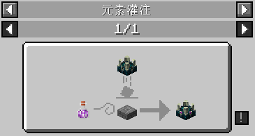

This block functions like a Sculk Shrieker and summons the Warden, but it’s easier to trigger. Be careful when setting
up the ritual...