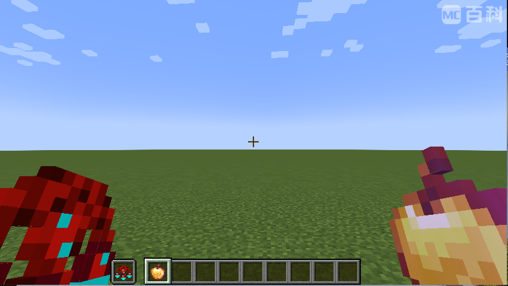

# Add Crops

Croparia IF allows you to define new crops that can produce customized materials.

You can create new crops using either [the Dalarion way](https://www.curseforge.com/minecraft/mc-mods/croparia) or by
following the detailed steps below.

Additionally, you can use KubeJS. Refer to [KubeJS Support - Add Crops](kubejs/Add%20Crops.md) for details.

**Note:** Your changes to custom crops take effect only after restarting the game.

---

## I. Quick Crop Generation via Commands

Starting from **Croparia IF 0.2.6**, you can quickly create a custom crop definition using commands.



As shown in the image above, hold the **material item** you wish your crop to produce in your **main hand**, and the *
*Croparia item** (indicating the crop's tier) in your **off hand**.

Then execute one of the following commands:

- **Client-side (single-player/local)**:  
  `/croparia create <color> [type] [name]`

- **Server-side** (also works in single-player mode):  
  `/cropariaServer create <color> [type] [name]`

### Command Arguments:

- **`<color>` (required)**: Crop's color as a hexadecimal number (e.g., `0xFF0000`).
- **`[type]` (optional)**: Crop category (default is `crop`). Other options include `animal`, `food`, `monster`, and
  `nature`.
- **`[name]` (optional)**: Identifier for the crop (defaults to the item's ID path).

Upon successful execution, a JSON file is created in your [`cropPath`](Configurations). Restart your game to activate
the changes.


You can directly open and modify this file by clicking the file path in the chat. For detailed editing instructions,
refer to [Text-based Crop Definitions](#ii-text-based-crop-definitions).

If you receive the message **"Duplicated crop... Try another name?"**, this means a crop with the same identifier
already exists, either built-in or in your [`cropPath`](Configurations).


Before creating a new definition, verify if an existing crop already satisfies your requirements. If not, use the "try
another name" suggestion and choose a unique identifier.

---

## II. Text-based Crop Definitions

### Step 1: Identify the Material

You must specify which item the crop will produce.

Activate Minecraft's advanced item info with `F3 + H`, which displays item IDs in your inventory. Manually copy the
desired ID.

Alternatively, you may use an **item tag** (prefix with `#`). However, note that the crop will produce only the first
matching item for the given tag.

Example format:

```json
{
  ...
  "material": "modid:item_id"
  // prefix with '#' if using item tag
  ...
}
```

---

### Step 2: Define Crop ID

Croparia IF requires a unique ID for each crop definition, following Minecraft's identifier format (lowercase, no
spaces, underscores allowed). Do not include namespaces.

Example format:

```json
{
  ...
  "name": "unique_crop_id"
  ...
}
```

---

### Step 3: Set Crop Tier

The crop's **tier** determines crafting difficulty—higher tiers require more complex materials. The default tier is `1`.

Example format:

```json
{
  ...
  "tier": 3
  ...
}
```

---

### Step 4: Define Crop Color

Define the crop's visual color using a hexadecimal value.

Example format:

```json
{
  ...
  "color": "0x8B8B8B"
  ...
}
```

---

### Step 5: (Recommended) Declare Dependencies

Optionally specify mod dependencies to conditionally load crops.

Example format:

```json
{
  ...
  "dependencies": [
    [
      "mod_a",
      "mod_b"
    ],
    [
      "mod_c"
    ]
  ]
  ...
}
```

**Note:**

- Inner arrays (`["mod_a", "mod_b"]`) evaluate true if **any listed mod** is loaded.
- Outer array evaluates true only if **all inner arrays** are true.

---

### Step 6: (Optional) Crop Type

Crop types define default models and textures. Default type is `crop`.

Available types:

- `animal`
- `crop`
- `food`
- `monster`
- `nature`

Example format:

```json
{
  ...
  "type": "animal"
  ...
}
```

---

### Step 7: (Optional) Use Existing Translation Key

Croparia IF auto-generates a translation key:  
`crop.croparia.{crop_name}`

Use a custom translation key if preferred.

Example format:

```json
{
  ...
  "translationKey": "item.modid.item"
  ...
}
```

---

### Step 8: (Optional) Customized Translations

If no suitable translation key exists, provide custom translations as shown:

```json
{
  ...
  "translations": {
    "en_us": "Custom English name",
    "zh_cn": "自定义中文名称"
  }
  ...
}
```

---

### Step 9: Create and Save Crop File

Place the JSON file in:  
`{GameDir}/crops/<filename>.json`

A fully completed example (including optional fields):

```json
{
  "name": "unique_crop_id",
  "material": "modid:item_id",
  "type": "crop",
  "tier": 3,
  "translationKey": "item.modid.item",
  "color": "0x8b8b8b",
  "translations": {
    "en_us": "Custom English name",
    "zh_cn": "自定义中文名称"
  }
}
```

Restart the game to see your custom crop in action!

---

## Frequently Asked Questions (Q&A)

### How can I modify existing crops?

- **Using KubeJS:**  
  Refer to [KubeJS Support: Modify Crops](kubejs/Modify%20Crops.md) for runtime modifications.
- **Using JSON definitions:**  
  Create a [crop definition file](#ii-text-based-crop-definitions) named identically to an existing crop to override it.

### How can I remove a crop?

Use the `blacklist` setting in [Configurations](Configurations). Restart the game afterward to apply changes.